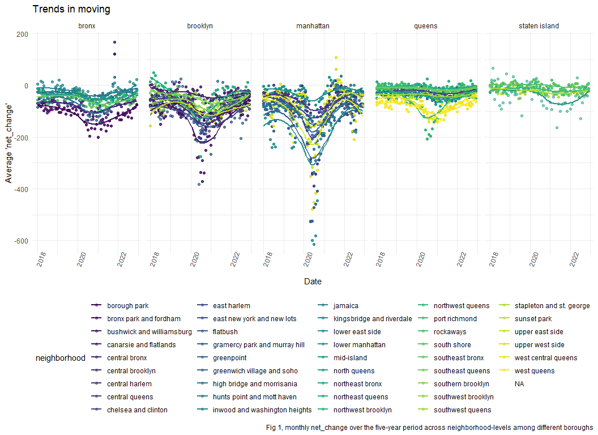

p8105_mtp_ps3395
================
Peng Su
2023-10-19

# Problem 1

``` r
#import the raw data
#ZIP code data
zip = 
  read_csv("data/Zip Codes.csv") |>
  janitor::clean_names()

#COA data
COA_2018 = 
  read_excel("data/USPS CHANGE OF ADDRESS NYC.xlsx", 
                 sheet = "2018") |>
  janitor::clean_names()

COA_2019 = 
  read_excel("data/USPS CHANGE OF ADDRESS NYC.xlsx", 
                 sheet = "2019") |>
  janitor::clean_names()

COA_2020 = 
  read_excel("data/USPS CHANGE OF ADDRESS NYC.xlsx", 
                 sheet = "2020") |>
  janitor::clean_names()

COA_2021 = 
  read_excel("data/USPS CHANGE OF ADDRESS NYC.xlsx", 
                 sheet = "2021") |>
  janitor::clean_names()

COA_2022 = 
  read_excel("data/USPS CHANGE OF ADDRESS NYC.xlsx", 
                 sheet = "2022") |>
  janitor::clean_names()
```

The raw “COA” dataset captures monthly data on the total number of COAs
entering and leaving each ZIP code in NYC from 2018 to 2022.
Additionally, the “ZIP codes” data contains information on the boroughs
and neighborhoods, totaling 324 observations, including NAs.

This report aims to analyze the COA changes in NYC between 2018 and
2022.

``` r
#Clean, Tidy and combine the data
zip = 
  zip |>
  mutate(
    borough = county_name,
    borough = str_replace(borough, "New York", "Manhattan")
  )

COA = 
  bind_rows(COA_2018, COA_2019, COA_2020, COA_2021, COA_2022) |>
  separate(month , into = c("year", "month", "day"), sep = "-") |>
  mutate(
    net_change = total_perm_in - total_perm_out
  ) |>
  select(everything(), zip_code = zipcode, -day)
length(unique(zip$zip_code))
```

    ## [1] 320

``` r
merge_df = 
  left_join(COA, zip, by = "zip_code", relationship = "many-to-many") |>
  mutate(
    city = str_to_lower(city),
    county_name = str_to_lower(county_name),
    neighborhood = str_to_lower(neighborhood),
    borough = str_to_lower(borough)
  ) |>
  drop_na()
```

COA data from different years were consolidated into a single `COA`
dataset, and a `year` variable was extracted from `month`. Also,
`net_change` variable was created to represent the difference between
inbound and outbound COAs. For `zip` dataset, `borough` was derived from
the `county_name`. Subsequently, the `zip` and `COA` were merged to
`merge_df` based on ZIP codes and missing values were removed to ensure
data quality. Furthermore, `Manhattan` was designated as the borough for
New York County, and characters such as `city` and `borough` were
converted to lowercase.

After the cleaning, `merge_df` now comprises a total of 10797
observations, encompassing 176 unique ZIP codes and 42 neighborhoods.

``` r
#comparison between City and Borough
#most common cities in Manhattan (top 5)

merge_df |>
  filter(
    borough == "manhattan"
  ) |>
  select(city, borough) |>
  count(city, name = "n_obs") |>
  top_n(5, wt = n_obs) |>
  arrange(desc(n_obs)) |>
  knitr::kable(col.names = c("city", "value"),
               caption = "Table 1, most common values of city in the borough of Manhattan")
```

| city             | value |
|:-----------------|------:|
| new york         |  2562 |
| bronx            |    60 |
| brooklyn         |    59 |
| canal street     |     4 |
| roosevelt isl    |     4 |
| roosevelt island |     4 |

Table 1, most common values of city in the borough of Manhattan

``` r
#most common cities in Queens (top 5)

merge_df |>
  filter(
    borough == "queens"
  ) |>
  select(city, borough) |>
  count(city, name = "n_obs") |>
  top_n(5, wt = n_obs) |>
  arrange(desc(n_obs)) |>
  knitr::kable(col.names = c("city", "value"),
               caption = "Table 2, most common values of city in the borough of Queens")
```

| city           | value |
|:---------------|------:|
| jamaica        |   308 |
| flushing       |   266 |
| astoria        |   230 |
| queens village |   165 |
| bayside        |   135 |

Table 2, most common values of city in the borough of Queens

Tables 1 and 2 present the most common cities in Manhattan and Queens.
Comparing with Queens, Manhattan’s data indicates a significant
disparity in the number of cities which may be attributed to variations
in the number of neighborhoods within each city.

Many ZIP codes in the raw data had fewer observations and included NA
values for neighborhoods. This can be attributed to regional variations
in geographical location and socioeconomic factors affecting data
collection. For instance, city like New York of Manhattan have the
resources to consistently report data, given their high population
density, resulting in 60 months of available data. Conversely, remote
rural neighborhoods often lack such resources, leading to limited data
collection. Additionally, geographically remote ZIP codes may not
collect neighborhood data as comprehensively as highly developed cities
may also contributing to the absence of neighborhood information.

# Problem 2

``` r
#reader-friendly table showing the average of net_change in each borough and year
merge_df |>
  select(year, borough, net_change) |>
  group_by(borough,year) |>
  summarize(
    mean_change = mean(net_change, na.rm = TRUE)
  ) |>
  pivot_wider(
    names_from = "year", 
    values_from = "mean_change"
    ) |>
  knitr::kable(digits = 2,
    caption = "Table 3, the average of 'net_change' in each borough and year") 
```

| borough   |   2018 |   2019 |    2020 |   2021 |   2022 |
|:----------|-------:|-------:|--------:|-------:|-------:|
| bronx     | -46.30 | -48.02 |  -72.65 | -66.10 | -53.19 |
| kings     | -49.88 | -55.90 | -119.31 | -81.21 | -57.28 |
| manhattan | -55.86 | -68.88 | -184.78 | -53.35 | -57.98 |
| queens    | -28.26 | -30.10 |  -49.33 | -45.94 | -30.23 |
| richmond  |  -9.85 |  -9.12 |  -10.70 | -22.55 | -16.30 |

Table 3, the average of ‘net_change’ in each borough and year

Table 3 shows that average `net_change` decreased in all boroughs except
Richmond, reaching their lowest points in 2020. This suggests that,
there were significantly more permanent address changes moving out of
each ZIP code than moving in.

``` r
#five lowest values of net_change over all obs.
merge_df |>
  top_n(-5, wt = net_change) |>
  select(year, month, zip_code, neighborhood) |>
  knitr::kable(caption = "Table 4, five lowest values of 'net_change' over all observations")
```

| year | month | zip_code | neighborhood                  |
|:-----|:------|---------:|:------------------------------|
| 2020 | 05    |    10022 | gramercy park and murray hill |
| 2020 | 06    |    10009 | lower east side               |
| 2020 | 06    |    10016 | gramercy park and murray hill |
| 2020 | 07    |    10009 | lower east side               |
| 2020 | 07    |    10016 | gramercy park and murray hill |

Table 4, five lowest values of ‘net_change’ over all observations

``` r
#before 2020, the five highest values of net_change.
merge_df |>
  filter(
    year < 2020
  ) |>
  top_n(5, wt = net_change) |>
  select(year, month, zip_code, neighborhood) |>
  knitr::kable(caption = "Table 5, the five highest values of 'net_change' over all observations before 2020")
```

| year | month | zip_code | neighborhood        |
|:-----|:------|---------:|:--------------------|
| 2018 | 04    |    11101 | northwest queens    |
| 2018 | 04    |    11201 | northwest brooklyn  |
| 2018 | 04    |    11201 | northwest brooklyn  |
| 2018 | 05    |    11101 | northwest queens    |
| 2018 | 06    |    11101 | northwest queens    |
| 2018 | 07    |    10001 | chelsea and clinton |

Table 5, the five highest values of ‘net_change’ over all observations
before 2020

``` r
#trend of moving
moving_trends = 
  merge_df |>
  mutate(
    date = paste(year, month, sep = "-"),
    date = as.Date(paste(date, "-01", sep = ""), format = "%Y-%m-%d"),
    neighborhood = as.factor(neighborhood),
    borough = as.factor(borough)
  ) |>
  select(
    date, zip_code, net_change, neighborhood, borough
  ) |>
  group_by(neighborhood, date) |>
  mutate(
    mean_change = mean(net_change, na.rm = TRUE )
  ) |>
  ggplot(aes(x = date, y = mean_change, color = neighborhood)) + 
  geom_point(alpha = .5) +
  geom_smooth(se = FALSE) +
  facet_grid(. ~ borough) +
  labs(x = "Date", 
       y = "Average 'net_change'",
       title = "Trends in moving",
       caption = "Fig 1, monthly net_change over the five-year period across neighborhood-levels among different boroughs") +
  theme(axis.text.x = element_text(angle = 70))

moving_trends
```



Figure 1 displays a five-year trend of average `net_change` across ZIP
codes within neighborhoods, with different colors representing distinct
neighborhoods. Notably, all boroughs, except for Richmond, exhibit
relatively similar moving trends. The majority of the time shows a
negative `net_change`, suggesting more people moved out of ZIP codes
than into them. This negative trend intensified from 2020 to 2021,
indicating a substantial increase in people leaving neighborhoods. The
trend is most pronounced in Manhattan, with notable outliers around
2020. Richmond’s moving trends remained fairly steady from 2018 to 2022.

However, this dataset lacks the initial population data. This limitation
makes it challenging to assess the changes in the context of the entire
population. Therefore, it’s difficult to accurately determine the
overall population size changes. Additionally, the levels of ZIP codes
can complicate the interpretation of population changes. Visualizing the
data by neighborhoods may offer a more comprehensible perspective.

``` r
wordcountaddin::text_stats("p8105_mtp_ps3395.Rmd")
```

| Method          | koRpus      | stringi       |
|:----------------|:------------|:--------------|
| Word count      | 495         | 479           |
| Character count | 3296        | 3296          |
| Sentence count  | 29          | Not available |
| Reading time    | 2.5 minutes | 2.4 minutes   |
